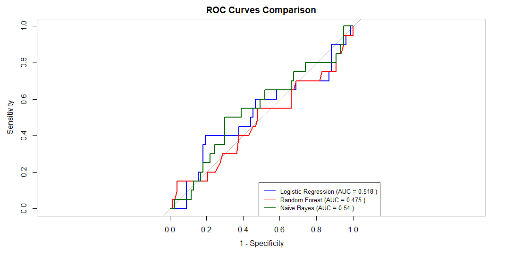
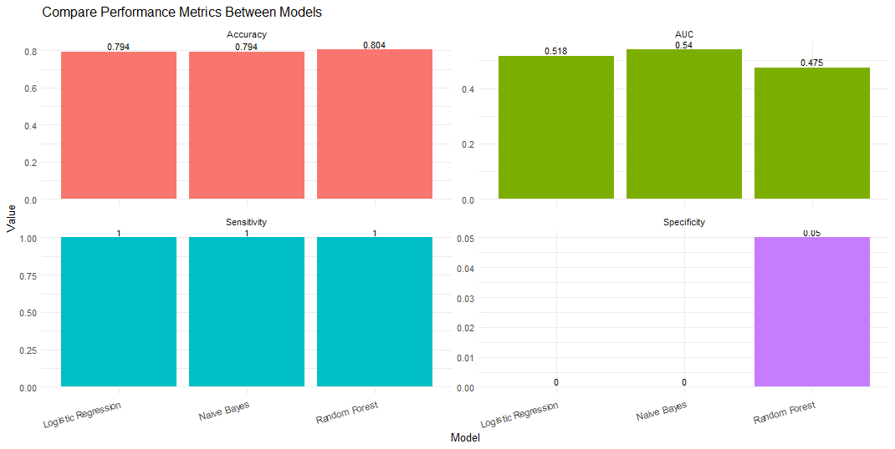

# Assignment of Probability and Statistics - MT2013  

Topic: Analysis of factors influencing the survival probability of breast cancer patients.

## Team member  

* Trần Nam Anh
* Nguyễn Phúc Huy
# About file structure
| Filename         | Description                                                             |
|------------------|-------------------------------------------------------------------------|
| `.gitignore`     | Configuration file to exclude files/directories from Git tracking.      |
| `./images`       | Use to store image for markdown.                                        |
| `BRCA.csv`       | BRCA dataset                                                            |
| `dataView.R`     | R script for viewing, analyzing, or visualizing the data.               |
| `extend.R`       | R script for extended with different model                              |
| `prediction.R`   | R script for prediction using only Logistic Regestion.                  |
| `readme.md`      | Project description file with usage instructions and overview.          |

# Model comparasion  
* ROC Curves Comparison
  
* Compare Performance Metrics Between Models  

The Overall performance is not as good as expect due to the lack of data in dataset and bias in "Alive"

